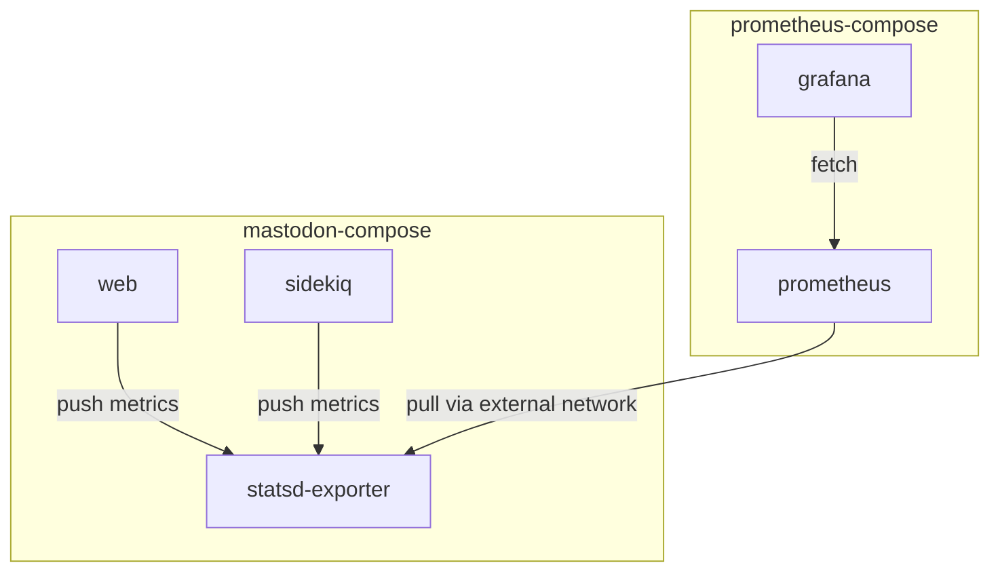

PrometheusとGrafanaでMastodonのモニタリング基盤を構築しました。

Grafana Labsで公開されていたMastodonのダッシュボードを参考に、カスタマイズしたダッシュボードを作成しています。

## 構成

今回はホスト環境への影響を小さくしたかったので、PrometheusとGrafanaをDockerコンテナで動かす方針で進めました。
調べた範囲ではホスト側にPrometheusやexporterをインストールする手順を見つけていたので、Prometheus自体の使い方とDockerのネットワークを追加で調べつつ環境を立てました。

以下の図のように2つのcomposeプロジェクトで構成しています。



実際のYAMLは以下のようになっています。



```mastodon/docker-compose.yml
# Mastodon側 docker-compose.yml
version: '3'
services:
  # ...省略
  mastodon-paltee-net-exporter: # 追加
    image: prom/statsd-exporter:v0.24.0
    command:
      - "--statsd.mapping-config=/etc/statsd-exporter/conf.yaml"
    volumes:
      - type: bind
        source: ./statsd-mapping.yaml
        target: /etc/statsd-exporter/conf.yaml
    networks:
      - internal_network
      - external_network
      - prometheus-paltee-exporter

networks:
  external_network:
  internal_network:
    internal: true
  prometheus-paltee-exporter: # 追加
    external: true
```

```prometheus/compose.yml
# Prometheus側 compose.yml
services:
  prometheus:
    restart: always
    image: prom/prometheus:v2.46.0
    volumes:
      - prometheus-data:/prometheus
    configs:
      - source: prometheus_config
        target: /etc/prometheus/prometheus.yml
    networks:
      - default
      - prometheus-paltee-exporter
    ports:
      - 9090:9090

  grafana:
    restart: always
    image: grafana/grafana:10.0.3
    environment:
      - GF_INSTALL_PLUGINS
      - GF_SERVER_ROOT_URL=https://grafana.paltee.dev
      - GF_FEATURE_TOGGLES_ENABLE=publicDashboards
      - GF_AUTH_ANONYMOUS_ENABLED=true
      - GF_AUTH_ANONYMOUS_ORG_NAME=Public
      - GF_AUTH_ANONYMOUS_ORG_ROLE=Viewer
      - GF_AUTH_ANONYMOUS_HIDE_VERSION=true
    volumes:
      - grafana-data:/var/lib/grafana
    ports:
      - 3030:3000
    networks:
      - default

configs:
  prometheus_config:
    file: ./prometheus.yml

volumes:
  prometheus-data:
  grafana-data:

networks:
  prometheus-paltee-exporter:
    external: true
```




MastodonとPrometheus間は`prometheus-paltee-exporter`の名前のネットワークで接続しています。
以下の`prometheus.yml`の設定の通り、Prometheus側からMastodon側で立ち上げたstatsd-exporterへアクセスする形となっています。

```prometheus.yml
global:
  scrape_interval: 30s
  evaluation_interval: 30s

scrape_configs:
  - job_name: prometheus
    scrape_interval: 60s
    static_configs:
      - targets: ['localhost:9090']
  - job_name: mastodon-paltee-net
    scrape_interval: 30s
    static_configs:
      - targets: ['mastodon-paltee-net-exporter:9102']
        labels:
          local_domain: 'don.paltee.net'
```

Prometheus自体はMastodon専用ではなく、運用しているホスト等のモニタリングを行うことも見据えて汎用的に使える様に構成することにしました。

監視したいサービスが増えた場合は以下の手順を踏んでメトリクスを取得できるようにする想定となります。

* 監視対象側へexporterを動かすコンテナの追加
* Prometheusから監視対象のメトリクスをpullできるようにネットワークを接続

## セットアップ

### Prometheus側

まずは`docker network create`で接続用のネットワーク`prometheus-paltee-exporter`を作成します。

前述した`prometheus.yml`から、`job_name: mastodon-paltee-net`のセクションをコメントアウトした状態でファイルを保存しておきます。
続けてPrometheus用のcomposeプロジェクトで`docker compose up -d`を実行して、新規に追加したstatsd-exporterのコンテナを立ち上げます。

### Mastodon側

Mastodon側ではexporterのセットアップを行います。
今回は以下の記事を参考にstatsd-exporterのmappingを定義した上で起動します。



Mastodonのアプリケーションで環境変数`STATSD_ADDR`に対しメトリクスの送信先を指定した上で再起動します。


### メトリクスの送信

`prometheus.yml`の設定に、先ほどコメントアウトしていたmastodonのstatsd-exporterにアクセスする部分を追加して再起動します。

Prometheus上のtsdbのステータスから、無事メトリクスが転送されていることが確認できました。




## ダッシュボードの追加

[Grafana LabsにあるMastodon用ダッシュボード](https://grafana.com/grafana/dashboards/17492-mastodon-stats/)を参考に、以下のメトリクスを表示することとしました。


* Puma
  * リクエスト数、処理時間統計(p99, p90, median)
* データベース
  * 実行クエリ数、クエリ実行時間統計
* Sidekiq
  * 処理ジョブ数、ジョブ処理時間
  * キューのレイテンシ
  * スケジュール済みジョブ数、リトライジョブ数

以下が実際の画面です。



## 匿名ユーザーの閲覧設定

以下を参考に環境変数を追加した上で再起動しました。



Organization単位でダッシュボードがPublicになるので、Organization名をPublicとしたものをanonymous authが有効なOrganizationとしています。

実際のダッシュボードは以下から確認できます。



## 終わりに

MastodonのメトリクスをPrometheusとGrafanaを使って可視化してみました。
次はGrafanaを使ったアラートの構成をしてみようと思います。

## 参考記事


