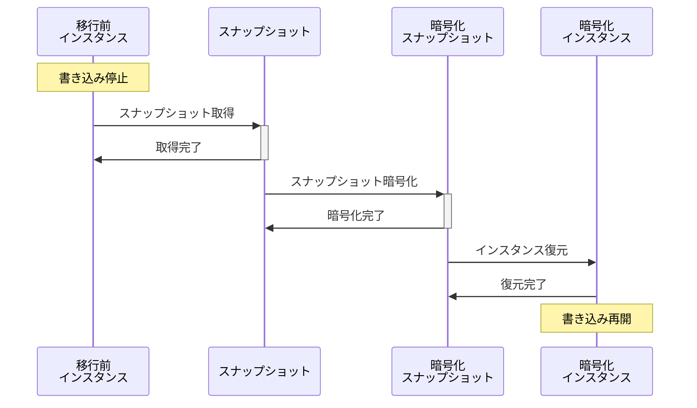
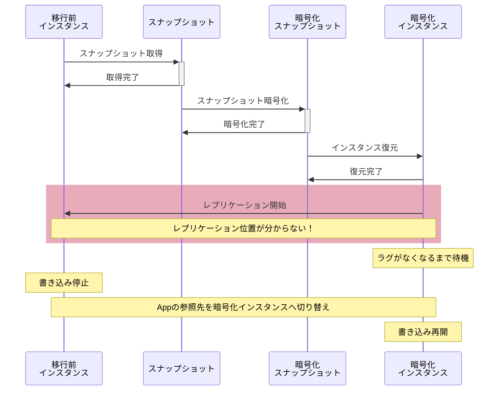
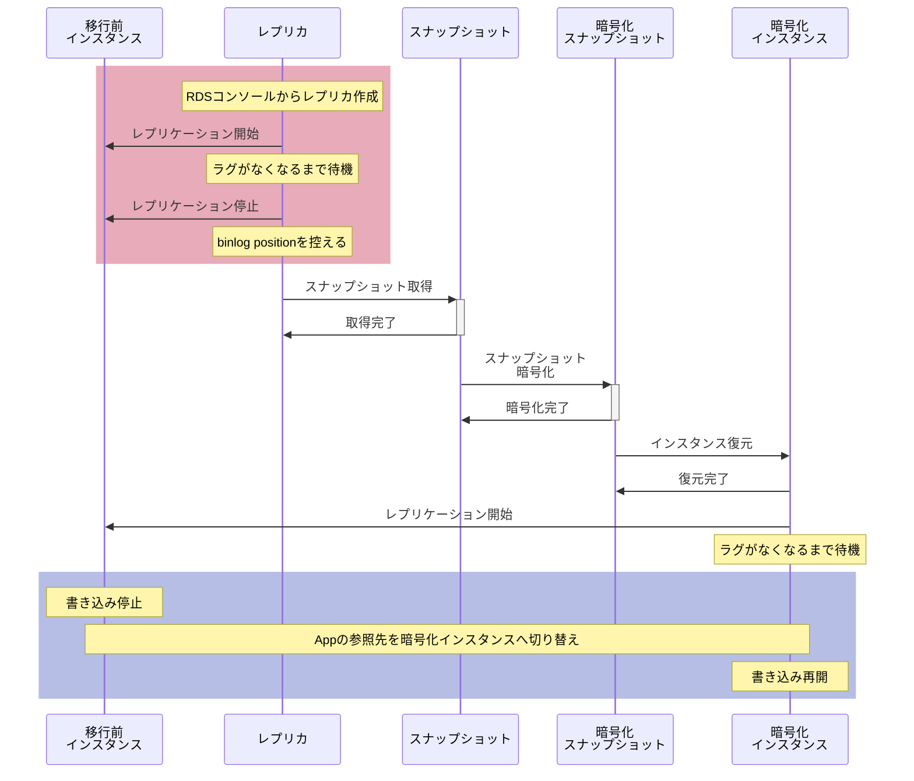

暗号化されていないAmazon RDS for MySQLのストレージを暗号化する機会がありました。
そのまま暗号化する方法では求められる要件を満たせなかったため、この記事では対応した手順を備忘としてまとめます。

## 課題

### RDSのストレージ暗号化における仕様

RDSのストレージを暗号化する場合、以下の制約があります。

* 暗号化されていないストレージで動作するRDSインスタンスは直接暗号化できない
* マネージドなレプリカ単体では暗号化を有効にできない

ナイーブにストレージの暗号化を行う場合、以下のようにスナップショットを取得後暗号化し、新規RDSインスタンスを起動する必要があります[^sequence-diagram-note]。



### 運用上の制約

以上の方法に対して、プロダクトの運用面では以下の制約がありました。

* 移行時にデータベースのデータが欠落しないよう、移行作業中はデータベースへの書き込みを止める必要がある
  * 上記の方法では、最初の「スナップショット取得」から「インスタンス復元完了」まで書き込みを止める必要がある
* ストレージサイズが大きく、スナップショットの操作には時間がかかる
  * スナップショットの取得と暗号化、新規インスタンスの復元をトータルで考慮すると、ダウンタイムが許容可能な長さを超える

## 方針

上記の課題に対して、ダウンタイムを小さくすることを目的としてバイナリログによるレプリケーションを活用する方針を立てました。

事前にデータベースのスナップショットを取得し、そのスナップショットを暗号化して復元したインスタンスへ手動のレプリケーションを構築した上で、アプリケーションの参照先を暗号化したインスタンスへ振り向けます。

しかしそのままレプリケーションを構成しようとすると、以下のように暗号化インスタンス側で「どこからレプリケーションを再開すればよいか分からなくなる」という問題が発生します。
これはAWSコンソール上でスナップショット取得時のログのポジションが取得できないためです。



この問題に対して、さらに1段階レプリカを作成する形で解決を図ることにしました。
大まかな手順としては以下のようになります。



赤く示した箇所で事前にリードレプリカを作成してからレプリケーションを停止し、バイナリログの位置を控えてからリードレプリカのスナップショットを取得するようにしています。ストレージ暗号化後のインスタンスでは、ここで控えた位置からレプリケーションを再開します。

また、最終的なダウンタイムは青色で示した参照先インスタンスの切り替え時のみとなりました。

全体の流れを整理すると、大きく以下の3パートになります。

* 暗号化に使うためのスナップショットの取得
  * 移行前のインスタンスからリードレプリカを作成する
  * リードレプリカに対するレプリケーションを停止し、バイナリログの位置を記録する
  * リードレプリカのスナップショットを取得する
* 暗号化インスタンスの作成
  * 取得したスナップショットを暗号化する
  * 暗号化したスナップショットを復元し、ストレージが暗号化されているRDSインスタンスを作成する
  * 移行前インスタンスから暗号化したインスタンスへのレプリケーションを構築し、レプリケーションが追いつくまで待機する
* 参照先RDSインスタンスの切り替え
  * アプリケーションから移行前インスタンスへの書き込みを停止する
  * 参照先を暗号化したインスタンスへ入れ換え書き込みを再開する


## 手順

移行前のデータベースを`prod-db`、スナップショット暗号化のために一時的に作成するレプリカを`prod-db-replica`、最終的に暗号化した状態で移行前のインスタンスと入れ替える対象となるデータベースを`encrypted-prod-db`とします。

### レプリカの作成

まずは`prod-db`側でバイナリログの保持期間を上限いっぱいの168時間に設定しておきます。
```plain
mysql> call mysql.rds_set_configuration('binlog retention hours', 168);
Query OK, 0 rows affected (0.00 sec)

mysql> call mysql.rds_show_configuration;
+------------------------+-------+-----------------------------------------------------------------------------------------------------------+
| name                   | value | description                                                                                               |
+------------------------+-------+-----------------------------------------------------------------------------------------------------------+
| binlog retention hours | 168   | binlog retention hours specifies the duration in hours before binary logs are automatically deleted.      |
| source delay           | 0     | source delay specifies replication delay in seconds between current instance and its master.              |
| target delay           | 0     | target delay specifies replication delay in seconds between current instance and its future read-replica. |
+------------------------+-------+-----------------------------------------------------------------------------------------------------------+
3 rows in set (0.01 sec)

Query OK, 0 rows affected (0.01 sec)
```

AWSコンソールから`prod-db`のレプリカとして`prod-db-replica`を作成します。

### レプリケーション停止とレプリケーション位置の記録

MySQLクライアントで`prod-db-replica`に接続し、レプリケーションを停止します。
```plain
mysql> call mysql.rds_stop_replication;
+-------------------------------+
| Message                       |
+-------------------------------+
| Slave is now down or disabled |
+-------------------------------+
1 row in set (3.04 sec)

Query OK, 0 rows affected (3.04 sec)
```

`show slave status`を実行し、レプリケーション停止時点の位置として`Relay_Master_Log_File`, `Exec_Master_Log_Pos`の値を控えます[^mysql-replication-position]。


```plain
mysql> show slave status\G
*************************** 1. row ***************************
               Slave_IO_State:
                  Master_Host: <master host>
                  Master_User: rdsrepladmin
                  Master_Port: 3306
                Connect_Retry: 60
              Master_Log_File: mysql-bin-changelog.000006
          Read_Master_Log_Pos: 544
               Relay_Log_File: relaylog.000007
                Relay_Log_Pos: 780
        Relay_Master_Log_File: mysql-bin-changelog.000006
             Slave_IO_Running: No
            Slave_SQL_Running: No
...
          Exec_Master_Log_Pos: 544
...
1 row in set (0.01 sec)
```

### スナップショット取得と暗号化

レプリケーションを停止した状態で、AWSコンソールから`prod-db-replica`のスナップショットを取得します。
取得したスナップショットを選択し、メニューからコピーします。

スナップショットコピー時の設定として、暗号化をオンにした上でコピーします。



### 暗号化インスタンスの作成

前の手順で取得した暗号化済みスナップショットから復元を行い、新規インスタンスとして`encrypted-prod-db`を作成します。

### レプリケーションの再開

作成した`encrypted-prod-db`は新規インスタンスのため、マネージドにレプリケーションを行うことができません。

手動でレプリケーションするために、`prod-db`側にレプリケーション用のユーザーを追加しておきます。

```plain
mysql> CREATE USER 'repl'@'172.16.%' IDENTIFIED BY '3cbb2f06c69b157879d68540fb3b7ea9';
Query OK, 0 rows affected (0.01 sec)

mysql> GRANT REPLICATION CLIENT, REPLICATION SLAVE ON *.* TO 'repl'@'172.16.%';
Query OK, 0 rows affected (0.00 sec)
```

上記では接続元として許可するネットワークを指定しています。

`prod-db`側にユーザを作成したら、以下を`encrypted-prod-db`側で実行し、レプリケーションを再開します。

```plain
CALL mysql.rds_set_external_master('<移行元インスタンスのエンドポイント>',3306,'repl','<password>','<確認したbinlog file (Relay_Master_Log_File)>',<確認したbinlog position値 (Exec_Master_Log_Pos)>,<ssl_encryption>)
CALL mysql.rds_start_replication
```

今回は以下のようになります。

```plain
mysql> CALL mysql.rds_set_external_master('prod-db.ercaaefjiqiq.ap-northeast-1.rds.amazonaws.com',3306,'repl','3cbb2f06c69b157879d68540fb3b7ea9','mysql-bin-changelog.000006',544,0);
Query OK, 0 rows affected (0.05 sec)

mysql> CALL mysql.rds_start_replication;
+-----------------------------------------------------+
| Message                                             |
+-----------------------------------------------------+
| Replication started. Slave is now running normally. |
+-----------------------------------------------------+
1 row in set (3.04 sec)

Query OK, 0 rows affected (3.04 sec)
```

`show slave status`を実行し、問題なくレプリケーションが進行していることが確認できれば、レプリカラグが小さくなり`prod-db`に追いつくまで待ちます。

### 参照先インスタンスの切り替え

`encrypted-prod-db`側が`prod-db`に追いついたら、アプリケーションからのアクセスとレプリケーションを止め、データベースの参照先を切り替えます。

まずはアプリケーションからのアクセスを止め、`prod-db`側で`show processlist`を実行し動作中のクエリが存在しないか確認します。

```plain
mysql> show processlist;
+----+-----------------+--------------------+----------+-------------+------+---------------------------------------------------------------+------------------+
| Id | User            | Host               | db       | Command     | Time | State                                                         | Info             |
+----+-----------------+--------------------+----------+-------------+------+---------------------------------------------------------------+------------------+
|  5 | event_scheduler | localhost          | NULL     | Daemon      | 2417 | Waiting on empty queue                                        | NULL             |
|  8 | rdsadmin        | localhost          | mysql    | Sleep       |    3 |                                                               | NULL             |
| 22 | repl            | 172.16.1.100:34882 | NULL     | Binlog Dump |   94 | Master has sent all binlog to slave; waiting for more updates | NULL             |
| 23 | admin           | 172.16.0.23:53296  | rds_test | Query       |    0 | init                                                          | show processlist |
+----+-----------------+--------------------+----------+-------------+------+---------------------------------------------------------------+------------------+
4 rows in set, 1 warning (0.01 sec)
```

動作中のクエリがなければ、`encrypted-prod-db`側で以下のようにレプリケーションを停止し、レプリケーションの設定をリセットします。

```plain
mysql> call mysql.rds_stop_replication;
+-------------------------------+
| Message                       |
+-------------------------------+
| Slave is now down or disabled |
+-------------------------------+
1 row in set (3.03 sec)

Query OK, 0 rows affected (3.03 sec)

mysql> call mysql.rds_reset_external_master;
+----------------------+
| message              |
+----------------------+
| Slave has been reset |
+----------------------+
1 row in set (0.03 sec)

Query OK, 0 rows affected (0.03 sec)
```

続いてアプリケーションが新たなRDSインスタンスを参照できるように参照先を切り替えます。
今回はデータベースを参照するためのDNSレコード設定を更新の上、アプリケーションを再起動する形で対応しました。


ここで万が一意図せず参照先インスタンスが変更されなかったアプリケーションがある場合、データに不整合が生じる可能性があります。
このため、一切のinbound通信を受けつけないセキュリティグループを事前に作成しておき、アプリケーション側で参照先を切り替える前に移行前のインスタンス`prod-db`のセキュリティグループに設定しています。


## おわりに

レプリケーションを用いてできるだけ短いダウンタイムでRDSのストレージを暗号化するためにとった手順についてまとめました。

今回はストレージの暗号化として行いましたが、データベースのバージョンアップなど、ダウンタイムを小さくしてメンテナンスを行う必要がある場合に有効なやり方かと思います。

[^sequence-diagram-note]: シーケンス図としてはオペレータやアプリケーションのactorを入れたかったのですが、幅が大きくなるので省略しています。
[^mysql-replication-position]: MySQLのslave statusで表示されるカラムって名前が似ているものもあり一瞬混乱しませんか？私だけ？
