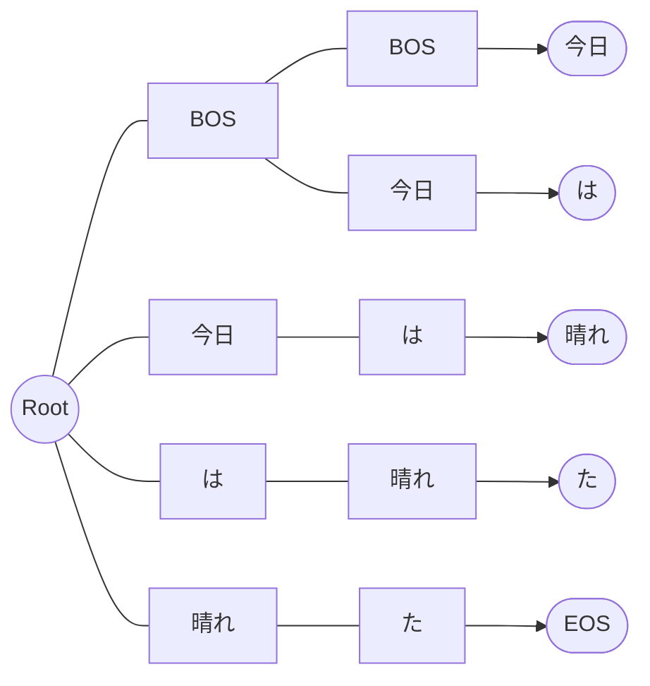

マルコフ連鎖モデルで過去の自分の投稿から文章を生成するbotを作成していました。

2022年に作ってからしばらくいじっていなかったのですが、週末に改修したのでこのタイミングでまとめることにしました。

リポジトリは以下です。



既存実装としてはPythonのプロジェクトがありましたが、コンパイルされたバイナリで実行したかった点、マルコフ連鎖のライブラリへの参照があった点から勉強を兼ねて自作してみることにしました。

## パッケージ構成

パッケージとしては、大きくメッセージ取得と投稿処理、形態素解析処理、マルコフ連鎖のモデル処理、フロントエンドとしてのCLIからなります。

### メッセージ取得と投稿 (blogパッケージ)

ソースとなるメッセージの取得、生成した文章の投稿を行うパッケージです。




メッセージ取得の作りとしては、以下のようにイテレーターとして投稿のリストを返すようメソッドを定義しています。
これはマルコフ連鎖のモデル生成時にいくつの投稿を学習するかという要素を気にせずに実装することを目的としています。
このため、実装側は1回のリクエストで取得できる最大の投稿を取得するように実装するだけで良い想定です。

```go
type BlogClient interface {
	GetPostsFetcher() ChunkIteratorFunc[string]
	CreatePost(body string) error
}

type ChunkIteratorFunc[T any] func() ([]T, bool, error)
```

また、作った当初は投稿の取得、生成した文章の投稿の両方がMastodon専用となっていました。
別のActivityPub実装を使っているユーザーからこのbotを使おうか検討していると聞いたため、
クライアント部分をインターフェース化して他の実装にも対応できるように改修しました。

### 形態素解析 (morphemeパッケージ)

取得したメッセージに対して形態素解析を行うパッケージです。



インターフェースとしては、入力の文章を形態素解析した結果を文字列のスライスとして返します。
複数の文章へ分割される可能性もあるため、スライスのスライスを返す作りとなっています。

```go
type MorphemeAnalyzer interface {
	Analyze(sentence string) ([][]string, error)
}
```

形態素解析エンジンとしてはMeCabを利用する実装を作成していますが、MorphemeAnalyzerインターフェースを実装する形で他の実装を利用することができるようにしています。

### マルコフ連鎖 (markovパッケージ)

マルコフ連鎖のモデル生成、モデルからの文章生成を行うパッケージです。



#### モデル生成

モデル生成時はChain構造体のAddSourceメソッドで入力として文字列(形態素)のスライスを受け取り、木構造のmapへ出現頻度とともに記録します。

マルコフ連鎖モデルでは直前までの状態によって次の状態へ遷移しますが、これをmapを使った以下のような入れ子構造で表現しています。

```go
type chainNode struct {
	Children    map[string]*chainNode `json:"children"`
	Occurrences int                   `json:"occurences"`
}
```

参照する状態数が2の場合、マーカーとして状態数分のBOS(Beginning of Sentence)を先頭に、EOS(End of Sentence)を末尾に入れておきます。

例えば「今日は晴れた」という文章であれば以下のようになります。

```
[BOS, BOS, 今日, は, 晴れ, た, EOS]
```

このスライスを先頭から状態数ずつ読み進めると、各状態とそれに対応する次の状態は以下の関係となります。

```plain
[BOS, BOS] -> 今日
[BOS, 今日] -> は
[今日, は] -> 晴れ
[は, 晴れ] -> た
[晴れ, た] -> EOS
```

現状態から次に出現する要素へ解決できるように、以下の形でモデルのルートから各ノードへの参照をこしらえます。



例ではサンプルとして1文章のみから生成したモデルを図示していますが、複数のサンプルからモデルを生成することで各ノードからの分岐が増えていきます。

#### 文章生成

この生成したモデルに対してGenerateメソッドを呼び出し、結果を連結することで文章を生成します。
Generateメソッドでは状態数分のBOSを初期状態として、EOSへ遷移するまで次の状態への遷移を繰り返して得られたスライスを返します。

以下のように、頻度が多いワードはそれに見合った確率で選択されるように重みをつけています。



### フロントエンドと永続化

フロント実装として、CLIとLambda関数を作成しています。



両者での基本的な流れは以下の通りです。

* モデルが未生成か有効期限切れであればモデルを構築し保存する
* モデルから文章を生成する
* 生成した文章を投稿する

データストアは以下のインターフェースで抽象化し、場所を問わずにモデルデータや設定の入出力ができるようにしました。

```go
type PersistentStore interface {
	Load() ([]byte, error)
	ModTime() (time.Time, bool, error)
	Save(data []byte) error
}
```

ローカルではファイルへ、Lambda関数ではS3へデータを永続化するように実装しています。

## DockerイメージとLambda関数としてのデプロイ


アプリケーション自体はGo言語で実装していますが、形態素解析を行うMeCabとあわせてランタイムを構築できるよう、以下のDockerfileを定義しています。



また、このイメージを利用するCloudFormationのテンプレートを作成し、Lambda関数としてデプロイできるように構成しています。



詳細はREADMEに譲りますが、S3バケット上に設定ファイルを配置し、EventBridgeを経由して定期実行する環境で運用しています。

## おわりに

自前でマルコフ連鎖botを作成しました。
モデルの実装作業も楽しかったですが、使われ方を考えながら抽象化する工程も良い塩梅にできたかなと感じます。

生成される文章を眺めてそんな投稿してたっけとなったり、そこそう繋がるの？という発見もあり、見ているだけでも結構楽しいです。

定期実行かつ1回の実行コストも高くなかったので、Lambda関数の使い方を学ぶ良い題材にもなりました。
本人は自宅鯖でトゥートしていますが、ある意味本人よりも堅牢な環境で動いています(？)
